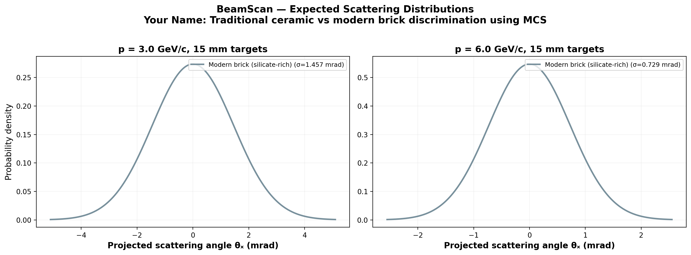
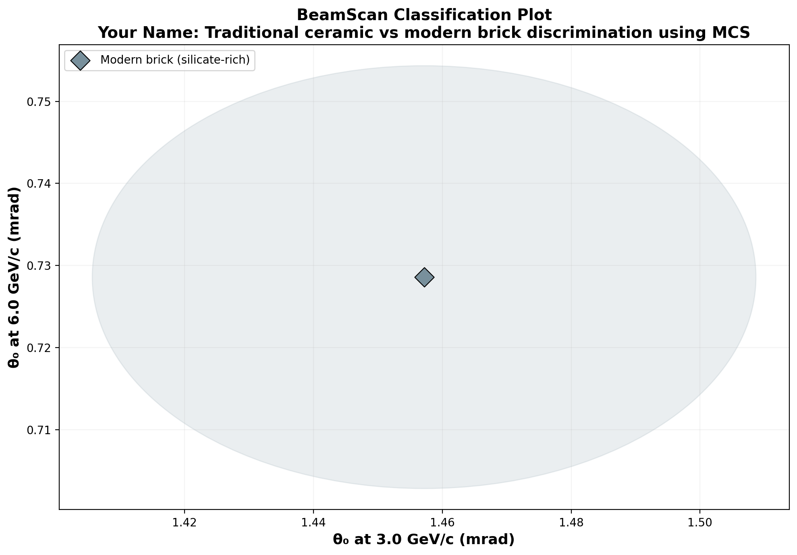

# 🔬 BeamScan Simulation Results

**Author:** Your Name  
**Description:** Traditional ceramic vs modern brick discrimination using MCS  
**Generated:** 2026-03-02 15:23 UTC  
**Method:** Highland formula (analytical)

## Beam Settings
- Particle: `e-`
- Momenta: [3.0, 6.0] GeV/c
- Events requested: 10,000

## Predictions

| Material | p (GeV/c) | θ₀ (mrad) | ΔE (MeV) | X₀ (cm) | Thickness |
|----------|-----------|-----------|----------|---------|----------|
| Modern brick (silicate-rich) | 3.0 | **1.457** | 6.6 | 12.29 | 15.0 mm |
| Modern brick (silicate-rich) | 6.0 | **0.729** | 6.6 | 12.29 | 15.0 mm |

## Figures

---
*Generated automatically by BeamScan Highland Calculator*
